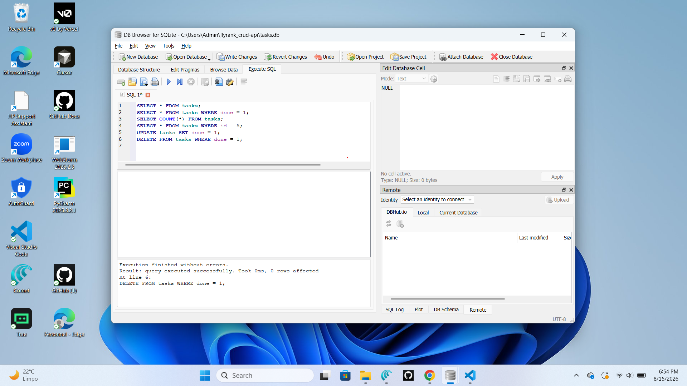

# FlyRank CRUD API

A small SQLite-backed CRUD API built with FastAPI and Python for the FlyRank Backend AI Engineering Week 2 challenge. It demonstrates REST endpoints, request validation, error handling, and automatic Swagger documentation.

## Table of Contents

- [Overview](#overview)
- [Database Project](#database-project)
- [Technologies](#technologies)
- [Project Structure](#project-structure)
- [Setup & Installation](#setup--installation)
- [Running the Server](#running-the-server)
- [API Endpoints](#api-endpoints)
- [Testing the API](#testing-the-api)
- [Swagger Screenshot](#swagger-screenshot)
- [Assignment Stages](#assignment-stages)
- [Learning Objectives](#learning-objectives)
- [Commit Guidelines](#commit-guidelines)

---

## Overview

This project demonstrates how to build a RESTful API using Python and FastAPI. It covers fundamental backend engineering concepts including:

- HTTP methods and status codes
- Route handling and decorators
- JSON request/response lifecycle
- Health check endpoints
- CRUD operations (Create, Read, Update, Delete)
- Automatic OpenAPI documentation through Swagger UI

# Database Project

### Why SQLite?

This project is a small CRUD API, so SQLite is a strong fit. It is lightweight, serverless, and file-based, which means there is no separate database server to install or manage. That keeps the setup simple while still providing a reliable relational database for storing the task records used by the API.

### Database Location

The SQLite database is defined in `app/database.py` with `Path(__file__).resolve().parent.parent / "tasks.db"`. Because the file is resolved from the application folder to the project root, the database is stored in the repository root as `tasks.db`.

This means the database file is located at:

```text
C:\Users\Admin\flyrank_crud-api\tasks.db
```

### How to Run the Project

```bash
# Activate the virtual environment (Windows)
venv\Scripts\activate

# Install dependencies
pip install -r requirements.txt

# Start the FastAPI application with Uvicorn
uvicorn app.main:app --reload --port 8080
```

Then open the API documentation in a browser:

```text
http://127.0.0.1:8080/docs
```

### Database Viewer Screenshot



*This screenshot shows the SQLite database being inspected in a database viewer while reviewing the `tasks` table.*

### Example SQL Query

```sql
SELECT * FROM tasks;
```


This query retrieves all rows from the `tasks` table so the stored task records can be reviewed and verified.

---

## Technologies

| Technology | Version | Purpose |
|------------|---------|---------|
| Python     | 3.11+   | Programming language |
| FastAPI    | 0.140+  | Web framework |
| Uvicorn    | 0.51+   | ASGI server |
| Pydantic   | 2.13+   | Data validation |

---

## Project Structure

```
flyrank_crud-api/
├── app/
│   ├── __init__.py          # Makes app/ a Python package
│   └── main.py              # FastAPI application entry point
├── venv/                    # Virtual environment (not committed)
├── requirements.txt         # Python dependencies
└── README.md                # Project documentation
```

---

## Setup & Installation

### 1. Clone the repository

```bash
git clone <repository-url>
cd flyrank_crud-api
```

### 2. Create a virtual environment

```bash
python -m venv venv
```

### 3. Activate the virtual environment

**Windows:**
```bash
venv\Scripts\activate
```

**macOS/Linux:**
```bash
source venv/bin/activate
```

### 4. Install dependencies

```bash
pip install -r requirements.txt
```

If you want a single command to install the project dependencies, use:

```bash
pip install -r requirements.txt
```

---

## Running the Server

```bash
uvicorn app.main:app --reload --port 8080
```

Server will start at: `http://127.0.0.1:8080`

---

## API Endpoints

| Method | Endpoint | Description | Success Response |
|--------|----------|-------------|------------------|
| GET | `/` | Returns API metadata | `200 OK` with project name and version |
| GET | `/health` | Health check endpoint | `200 OK` with `{"status": "ok"}` |
| GET | `/tasks` | Lists all tasks | `200 OK` with the task list |
| GET | `/tasks/{task_id}` | Returns one task by ID | `200 OK` or `404 Not Found` |
| POST | `/tasks` | Creates a new task | `201 Created` or `400 Bad Request` |
| PUT | `/tasks/{task_id}` | Updates a task | `200 OK`, `400 Bad Request`, or `404 Not Found` |
| DELETE | `/tasks/{task_id}` | Deletes a task | `204 No Content` or `404 Not Found` |

---

## Testing the API

### Browser

Open `http://127.0.0.1:8080/` in your browser.

### Swagger UI (Interactive Docs)

Open `http://127.0.0.1:8080/docs` — FastAPI auto-generates this.

### curl

```bash
# Root endpoint
curl http://127.0.0.1:8080/

# Health check
curl http://127.0.0.1:8080/health

# Create a task
curl -i -X POST http://127.0.0.1:8080/tasks -H "Content-Type: application/json" -d '{"title":"Write README"}'
```

### Expected Responses

**GET /**
```json
{
  "name": "Task API",
  "version": "1.0",
  "endpoints": ["/tasks"]
}
```

**GET /health**
```json
{"status": "ok"}
```

**POST /tasks**
```http
HTTP/1.1 201 Created
content-length: 44
content-type: application/json

{"id":4,"title":"Write README","done":false}
```

### Swagger Screenshot

The Swagger UI for this project was verified in the browser during Stage 5. Add the captured screenshot here in your final documentation export.

---

## Assignment Stages

| Stage | Name                  | Status      | Description                              |
|-------|-----------------------|-------------|------------------------------------------|
| 0     | Hello, Server         | Completed   | Project setup, FastAPI + Uvicorn         |
| 1     | Root & Health         | Completed   | GET / and GET /health endpoints          |
| 2     | Read Operations      | Completed   | GET /tasks and GET /tasks/{task_id}      |
| 3     | Create Operation     | Completed   | POST /tasks with validation and 201      |
| 4     | Update & Delete      | Completed   | PUT /tasks/{task_id} and DELETE /tasks/{task_id} |
| 5     | Swagger UI           | Completed   | Endpoint docs, summaries, and descriptions |

---

## Learning Objectives

After completing this project, you will understand:

1. **HTTP Methods** — GET, POST, PUT, DELETE and when to use each
2. **Route Decorators** — How `@app.get("/")` maps URLs to functions
3. **Request-Response Lifecycle** — How a browser request becomes a JSON response
4. **Status Codes** — What 200, 201, 404, 500 mean
5. **ASGI Servers** — How Uvicorn serves your FastAPI application
6. **JSON Serialization** — How Python dicts become JSON responses
7. **Health Checks** — Why production systems need monitoring endpoints
8. **CRUD Operations** — The foundation of database-driven applications
9. **OpenAPI & Swagger** — How FastAPI generates interactive API documentation

### The Complete Request-Response Lifecycle

```
Browser/Client
    │
    ▼
HTTP Request (GET /health)
    │
    ▼
Uvicorn (ASGI Server) — receives raw HTTP bytes
    │
    ▼
FastAPI Router — matches "/health" to health_check function
    │
    ▼
health_check() — Python function executes
    │
    ▼
return {"status": "ok"} — Python dict returned
    │
    ▼
FastAPI — converts dict to JSON, wraps in HTTP response
    │
    ▼
HTTP Response
    HTTP/1.1 200 OK
    Content-Type: application/json
    {"status": "ok"}
    │
    ▼
Browser/Client receives response
```

---

## Commit Guidelines

Use conventional commit messages:

| Prefix    | When to use                        |
|-----------|------------------------------------|
| `feat:`   | New feature                        |
| `fix:`    | Bug fix                            |
| `docs:`   | Documentation changes              |
| `refactor:` | Code refactoring (no behavior change) |
| `test:`   | Adding or updating tests           |

### Stage Commits

```
Stage 0: feat: initialize FastAPI project with server setup
Stage 1: feat: add root and health check endpoints
Stage 2: feat: implement read operations for tasks
Stage 3: feat: add create task endpoint with validation and 201 responses
Stage 4: feat: add update and delete task endpoints
Stage 5: docs: improve Swagger UI documentation for all endpoints
```

---

## License

This project is part of the FlyRank Backend AI Engineering program.
